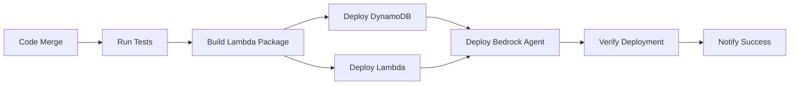

# 🔄 GitHub to AWS CI/CD Setup Guide

**Automatically deploy your BTC Market Hunter Agent to AWS on every code merge**

---

## 📋 Overview

This guide sets up a complete CI/CD pipeline that:

1. ✅ **Tests** your code on every push/PR
2. ✅ **Builds** Lambda deployment packages
3. ✅ **Deploys** to AWS automatically on merge to `main`
4. ✅ **Updates** DynamoDB, Lambda, and Bedrock Agent
5. ✅ **Verifies** deployment health
6. ✅ **Notifies** on success/failure

---

## 🎯 What Gets Deployed

When you merge code to `main`, GitHub Actions automatically:



---

## 🔧 Setup Steps

### Step 1: Configure AWS IAM User for GitHub Actions

Create a dedicated IAM user for CI/CD:

```bash
# 1. Create IAM user
aws iam create-user --user-name github-actions-deployer

# 2. Create access key
aws iam create-access-key --user-name github-actions-deployer

# Save the output! You'll need:
# - AccessKeyId
# - SecretAccessKey
```

**Save these credentials securely!** You'll add them to GitHub Secrets.

### Step 2: Attach IAM Policies

```bash
# Create custom deployment policy
cat > github-deployer-policy.json << 'EOF'
{
  "Version": "2012-10-17",
  "Statement": [
    {
      "Effect": "Allow",
      "Action": [
        "bedrock:*",
        "lambda:*",
        "dynamodb:*",
        "events:*",
        "iam:GetRole",
        "iam:CreateRole",
        "iam:AttachRolePolicy",
        "iam:PutRolePolicy",
        "iam:PassRole",
        "logs:*",
        "s3:*",
        "ssm:PutParameter",
        "ssm:GetParameter"
      ],
      "Resource": "*"
    }
  ]
}
EOF

# Create and attach policy
aws iam put-user-policy \
  --user-name github-actions-deployer \
  --policy-name DeploymentPolicy \
  --policy-document file://github-deployer-policy.json

echo "✅ IAM user configured"
```

### Step 3: Add GitHub Secrets

Go to your GitHub repository:

1. **Navigate to Settings** → **Secrets and variables** → **Actions**

2. **Click "New repository secret"** and add these secrets:

| Secret Name | Value | Description |
|-------------|-------|-------------|
| `AWS_ACCESS_KEY_ID` | `AKIA...` | From Step 1 |
| `AWS_SECRET_ACCESS_KEY` | `xxxxx...` | From Step 1 |
| `BEDROCK_AGENT_ID` | `AGENT123...` | After first deployment |
| `AWS_REGION` | `us-east-1` | (Optional) Override default |

**Screenshot Guide:**

```
GitHub Repo → Settings → Secrets and variables → Actions → New repository secret

Name: AWS_ACCESS_KEY_ID
Secret: AKIA................
[Add secret]

Name: AWS_SECRET_ACCESS_KEY  
Secret: wJalr.....................
[Add secret]
```

### Step 4: Enable GitHub Actions

The workflow file is already created: `.github/workflows/deploy-to-aws.yml`

Verify it's enabled:

1. Go to **Actions** tab in your GitHub repo
2. You should see "Deploy to AWS" workflow
3. It will trigger automatically on push to `main`

---

## 🚀 Usage

### Automatic Deployment (Recommended)

1. **Make changes** to your code
2. **Commit and push** to a feature branch
3. **Create a Pull Request** to `main`
4. **Tests run automatically** on the PR
5. **Merge to main** → Automatic deployment to AWS! 🎉

```bash
# Example workflow
git checkout -b feature/improve-market-analysis
git add src/market_hunter_agent_integrated.py
git commit -m "Improve market volatility detection"
git push origin feature/improve-market-analysis

# Create PR on GitHub → Merge → Automatic deployment!
```

### Manual Deployment

You can also trigger deployment manually:

1. Go to **Actions** tab
2. Select **Deploy to AWS** workflow
3. Click **Run workflow**
4. Choose environment (production/staging/development)
5. Click **Run workflow**

---

## 📊 Monitoring Deployments

### View Deployment Progress

1. Go to **Actions** tab
2. Click on the running workflow
3. Watch real-time logs

Example output:
```
✅ Run Tests Before Deploy
✅ Build Lambda Package
✅ Deploy DynamoDB Tables
✅ Deploy Lambda Function
✅ Deploy Bedrock Agent
✅ Verify Deployment
🎉 Deployment successful!
```

### Deployment Artifacts

After each deployment, you can download:
- **Lambda package** (market-hunter-lambda.zip)
- **Test coverage reports**
- **Deployment logs**

Available under **Actions** → **Workflow run** → **Artifacts**

---

## 🔍 Troubleshooting

### Common Issues

#### 1. "AWS credentials not configured"

**Problem:** GitHub secrets not set correctly

**Solution:**
```bash
# Verify secrets are added in GitHub:
# Settings → Secrets → AWS_ACCESS_KEY_ID
# Settings → Secrets → AWS_SECRET_ACCESS_KEY
```

#### 2. "Access Denied" errors

**Problem:** IAM user lacks permissions

**Solution:**
```bash
# Re-run Step 2 to attach deployment policy
aws iam put-user-policy \
  --user-name github-actions-deployer \
  --policy-name DeploymentPolicy \
  --policy-document file://github-deployer-policy.json
```

#### 3. "Bedrock model access not enabled"

**Problem:** Claude 3.5 Sonnet not enabled

**Solution:**
1. Go to AWS Console → Amazon Bedrock
2. Navigate to **Model access**
3. Request access to **Anthropic Claude 3.5 Sonnet**
4. Wait for approval (usually instant)

#### 4. "Lambda role not found"

**Problem:** First deployment - IAM roles don't exist yet

**Solution:** The workflow creates them automatically on first run. Just let it complete.

#### 5. "BEDROCK_AGENT_ID not set"

**Problem:** First deployment - agent hasn't been created yet

**Solution:**
1. First deployment creates the agent
2. Check workflow logs for: `⚠️ Please add BEDROCK_AGENT_ID=AGENT123... to GitHub Secrets`
3. Copy the Agent ID
4. Add it to GitHub Secrets as `BEDROCK_AGENT_ID`

---

## 🛡️ Security Best Practices

### 1. Use Minimal IAM Permissions

```bash
# Review current permissions
aws iam list-user-policies --user-name github-actions-deployer

# Remove if too broad
aws iam delete-user-policy \
  --user-name github-actions-deployer \
  --policy-name PolicyName
```

### 2. Rotate Access Keys Regularly

```bash
# Every 90 days, create new keys
aws iam create-access-key --user-name github-actions-deployer

# Update GitHub secrets
# Then delete old keys
aws iam delete-access-key \
  --user-name github-actions-deployer \
  --access-key-id OLD_KEY_ID
```

### 3. Use Environments for Production

GitHub Environments add approval gates:

1. Go to **Settings** → **Environments**
2. Create **production** environment
3. Add **Required reviewers**
4. Update workflow to use environment:

```yaml
deploy-bedrock-agent:
  environment: production  # Requires approval
  runs-on: ubuntu-latest
```

### 4. Enable Branch Protection

Protect your `main` branch:

1. **Settings** → **Branches** → **Add rule**
2. Branch name pattern: `main`
3. Enable:
   - ✅ Require pull request reviews
   - ✅ Require status checks to pass
   - ✅ Require branches to be up to date
   - ✅ Include administrators

---

## 📈 Advanced Configuration

### Multi-Environment Deployment

Deploy to staging first, then production:

```yaml
# Add to deploy-to-aws.yml
on:
  push:
    branches:
      - main        # → production
      - develop     # → staging
      - feature/*   # → development
```

### Slack/Discord Notifications

Add notification step:

```yaml
- name: Notify Slack
  uses: 8398a7/action-slack@v3
  with:
    status: ${{ job.status }}
    webhook_url: ${{ secrets.SLACK_WEBHOOK }}
```

### Rollback on Failure

```yaml
- name: Rollback on failure
  if: failure()
  run: |
    # Revert to previous Lambda version
    aws lambda update-function-code \
      --function-name market-hunter-action-handler \
      --s3-bucket backup-bucket \
      --s3-key previous-version.zip
```

### Cost Monitoring

```yaml
- name: Check deployment costs
  run: |
    # Get cost estimate
    aws ce get-cost-and-usage \
      --time-period Start=$(date -d '1 day ago' +%Y-%m-%d),End=$(date +%Y-%m-%d) \
      --granularity DAILY \
      --metrics BlendedCost
```

---

## 🧪 Testing the Pipeline

### Test 1: Small Change

```bash
# Make a small change
echo "# Updated $(date)" >> README.md
git add README.md
git commit -m "Test CI/CD pipeline"
git push origin main

# Watch GitHub Actions → Should deploy successfully
```

### Test 2: Lambda Update

```bash
# Update Lambda function
echo "# Performance improvement" >> src/bedrock_action_handler.py
git add src/bedrock_action_handler.py
git commit -m "Improve Lambda performance"
git push origin main

# Verify:
# 1. Tests run
# 2. Lambda package built
# 3. Lambda updated in AWS
# 4. Verification passes
```

### Test 3: Manual Trigger

1. Go to **Actions** tab
2. Click **Deploy to AWS**
3. Click **Run workflow**
4. Select **development** environment
5. Click **Run workflow**
6. Watch deployment progress

---

## 📊 Deployment Metrics

Track your deployment success:

### Success Rate
```bash
# View recent deployments
gh run list --workflow=deploy-to-aws.yml --limit 20

# Calculate success rate
gh run list --workflow=deploy-to-aws.yml --limit 100 --json conclusion \
  | jq '[.[] | select(.conclusion == "success")] | length'
```

### Deployment Duration
```bash
# Average deployment time
gh run list --workflow=deploy-to-aws.yml --limit 10 --json createdAt,updatedAt \
  | jq '[.[] | ((.updatedAt | fromdateiso8601) - (.createdAt | fromdateiso8601))] | add/length'
```

---

## 🎯 Next Steps

1. **Test the Pipeline**
   ```bash
   echo "test" >> README.md
   git add README.md
   git commit -m "Test deployment pipeline"
   git push origin main
   ```

2. **Monitor First Deployment**
   - Watch GitHub Actions logs
   - Note the BEDROCK_AGENT_ID
   - Add it to GitHub Secrets

3. **Set Up Notifications**
   - Add Slack webhook
   - Configure email alerts

4. **Add Staging Environment**
   - Create `develop` branch
   - Set up staging AWS account

5. **Enable Branch Protection**
   - Require PR reviews
   - Require passing tests

---

## 📚 Workflow Files

Your repository now has:

1. **`.github/workflows/deploy-to-aws.yml`** - Main deployment workflow
2. **`.github/workflows/test.yml`** - Test workflow (runs on PRs)

Both work together:
- **PRs** → Run tests only
- **Merge to main** → Run tests + deploy

---

## ✅ Checklist

Before going live:

- [ ] AWS IAM user created
- [ ] Access keys generated
- [ ] GitHub secrets added (`AWS_ACCESS_KEY_ID`, `AWS_SECRET_ACCESS_KEY`)
- [ ] IAM policies attached
- [ ] Bedrock model access enabled
- [ ] Test deployment run successfully
- [ ] `BEDROCK_AGENT_ID` added to GitHub secrets (after first deployment)
- [ ] Branch protection enabled
- [ ] Notifications configured (optional)
- [ ] Team members trained on workflow

---

## 🎉 Success!

Your GitHub repository is now connected to AWS! 

Every time you merge code to `main`:
1. ✅ Tests run automatically
2. ✅ Lambda package builds
3. ✅ DynamoDB tables update
4. ✅ Lambda function deploys
5. ✅ Bedrock Agent updates
6. ✅ Deployment verifies
7. ✅ You get notified

**No manual deployment needed!** 🚀

---

## 📞 Support

If you encounter issues:

1. Check **Actions** tab → **Workflow logs**
2. Review **Troubleshooting** section above
3. Verify AWS credentials in GitHub Secrets
4. Check IAM permissions
5. Review AWS service limits

---

## 🔗 Resources

- [GitHub Actions Documentation](https://docs.github.com/en/actions)
- [AWS IAM Best Practices](https://docs.aws.amazon.com/IAM/latest/UserGuide/best-practices.html)
- [AWS Bedrock Agent Guide](https://docs.aws.amazon.com/bedrock/latest/userguide/agents.html)
- [Project Documentation](./docs/)

---

**Happy Deploying! 🎊**
