# Market Hunter Agent - Mermaid Diagrams

## System Architecture Diagram

```mermaid
graph TB
    subgraph Input["📥 INPUT LAYER"]
        MD[Market Data<br/>Price, Volume, Change]
    end

    subgraph Context["🧠 CONTEXT ASSESSMENT"]
        CA[Context Analyzer]
        MD --> CA
        CA --> VOL[Volatility Detection<br/>HIGH/MEDIUM/LOW]
        CA --> TREND[Trend Analysis<br/>BULLISH/BEARISH/NEUTRAL]
        CA --> SESSION[Trading Session<br/>ASIAN/EU/US/OVERLAP]
    end

    subgraph Scoring["📊 AUTONOMOUS DECISION ENGINE"]
        VOL --> SCORE[Source Scoring<br/>Algorithm]
        TREND --> SCORE
        SESSION --> SCORE
        
        METRICS[(Source Metrics<br/>Success Rate<br/>Signal Quality<br/>Recency)] --> SCORE
        
        SCORE --> S1[whaleMovements: 0.85]
        SCORE --> S2[narrativeShifts: 0.72]
        SCORE --> S3[arbitrageOpps: 0.55]
        SCORE --> S4[influencerSignals: 0.78]
        SCORE --> S5[technicalBreakouts: 0.68]
        SCORE --> S6[institutionalFlows: 0.83]
        SCORE --> S7[derivativesSignals: 0.92]
        SCORE --> S8[macroSignals: 0.62]
    end

    subgraph Selection["🎯 SOURCE SELECTION"]
        S1 --> SEL[Select Top N Sources<br/>3-6 based on volatility]
        S2 --> SEL
        S3 --> SEL
        S4 --> SEL
        S5 --> SEL
        S6 --> SEL
        S7 --> SEL
        S8 --> SEL
        
        SEL --> SELECTED[Selected Sources<br/>e.g., 6 sources for HIGH volatility]
    end

    subgraph Bedrock["☁️ AMAZON BEDROCK AGENT"]
        SELECTED --> AGENT[Bedrock Agent<br/>Claude 3 Sonnet]
        
        AGENT --> AG[Action Group<br/>Lambda Functions]
        
        AG --> F1[query_whale_movements]
        AG --> F2[query_narrative_shifts]
        AG --> F3[query_arbitrage_opps]
        AG --> F4[query_influencer_signals]
        AG --> F5[query_technical_breakouts]
        AG --> F6[query_institutional_flows]
        AG --> F7[query_derivatives_signals]
        AG --> F8[query_macro_signals]
        
        KB[(Knowledge Base<br/>Historical Data<br/>Patterns)] --> AGENT
    end

    subgraph Analysis["🔍 ANALYSIS & SIGNAL GENERATION"]
        F1 --> RESULTS[Query Results]
        F2 --> RESULTS
        F3 --> RESULTS
        F4 --> RESULTS
        F5 --> RESULTS
        F6 --> RESULTS
        F7 --> RESULTS
        F8 --> RESULTS
        
        RESULTS --> ANALYZE[Bedrock Agent<br/>Pattern Analysis]
        
        ANALYZE --> SIG1[🐋 WHALE_ACTIVITY]
        ANALYZE --> SIG2[📈 POSITIVE_NARRATIVE]
        ANALYZE --> SIG3[🏦 INSTITUTIONAL_ACCUMULATION]
        ANALYZE --> SIG4[⚠️ EXTREME_FUNDING]
        ANALYZE --> SIG5[😱 EXTREME_FEAR]
        ANALYZE --> SIG6[🤑 EXTREME_GREED]
    end

    subgraph Learning["🎓 ADAPTIVE LEARNING"]
        RESULTS --> UPDATE[Update Metrics<br/>new = (1-α)×old + α×obs]
        
        UPDATE --> M1[Success Rate ↑/↓]
        UPDATE --> M2[Signal Quality ↑/↓]
        UPDATE --> M3[Recency Counter]
        
        M1 --> METRICS
        M2 --> METRICS
        M3 --> METRICS
    end

    subgraph Storage["💾 STORAGE & DISTRIBUTION"]
        SIG1 --> DB[(PostgreSQL<br/>Database)]
        SIG2 --> DB
        SIG3 --> DB
        SIG4 --> DB
        SIG5 --> DB
        SIG6 --> DB
        
        UPDATE --> DB
        
        DB --> DIST[Signal Distribution]
        
        DIST --> A1[bitcoin-orchestrator]
        DIST --> A2[risk-manager]
        DIST --> A3[trading-agent]
        DIST --> A4[portfolio-optimizer]
    end

    style MD fill:#e1f5ff
    style AGENT fill:#ff9800
    style SCORE fill:#4caf50
    style DB fill:#9c27b0
    style DIST fill:#f44336
```

## Decision Flow Sequence Diagram


## Learning Algorithm Flow


## State Machine Diagram


## Component Interaction Diagram

```mermaid
graph TB
    subgraph Python["🐍 Python Application Layer"]
        MHA[MarketHunterAgent<br/>market_hunter_agent.py]
        PS[ProductionService<br/>production_service.py]
        DBH[Database Handler<br/>database.py]
    end

    subgraph AWS["☁️ AWS Cloud Services"]
        subgraph BedrockService["Amazon Bedrock"]
            BA[Bedrock Agent<br/>Agent ID]
            FM[Claude 3 Sonnet<br/>Foundation Model]
            BAR[Bedrock Agent Runtime<br/>invoke_agent()]
        end
        
        subgraph Compute["AWS Lambda"]
            L1[Lambda: query_whale_movements]
            L2[Lambda: query_narrative_shifts]
            L3[Lambda: query_arbitrage_opps]
            L4[Lambda: query_influencer_signals]
            L5[Lambda: query_technical_breakouts]
            L6[Lambda: query_institutional_flows]
            L7[Lambda: query_derivatives_signals]
            L8[Lambda: query_macro_signals]
        end
        
        subgraph EventBus["Event Distribution"]
            EB[EventBridge]
            SQS[SQS Queues]
            SNS[SNS Topics]
        end
    end

    subgraph External["🌐 External APIs"]
        BC[Blockchain<br/>Explorers]
        SM[Social Media<br/>APIs]
        EX[Exchange<br/>APIs]
        DX[Derivatives<br/>Exchanges]
    end

    subgraph Database["💾 Data Layer"]
        PG[(PostgreSQL<br/>RDS)]
        TB1[agent_executions]
        TB2[source_metrics_history]
        TB3[system_alerts]
        TB4[8 Data Source Tables]
    end

    subgraph Agents["🤖 Other Agents"]
        A1[Bitcoin Orchestrator]
        A2[Risk Manager]
        A3[Trading Agent]
        A4[Portfolio Optimizer]
    end

    PS --> MHA
    MHA --> BAR
    BAR --> BA
    BA --> FM
    BA --> L1
    BA --> L2
    BA --> L3
    BA --> L4
    BA --> L5
    BA --> L6
    BA --> L7
    BA --> L8
    
    L1 --> BC
    L2 --> SM
    L3 --> EX
    L4 --> SM
    L5 --> EX
    L6 --> BC
    L7 --> DX
    L8 --> EX
    
    MHA --> DBH
    DBH --> PG
    PG --> TB1
    PG --> TB2
    PG --> TB3
    PG --> TB4
    
    MHA --> EB
    EB --> SQS
    SQS --> A1
    SQS --> A2
    EB --> SNS
    SNS --> A3
    SNS --> A4

    style MHA fill:#4caf50
    style BA fill:#ff9800
    style FM fill:#ff5722
    style PG fill:#9c27b0
    style EB fill:#2196f3
```

## Data Flow Diagram

```mermaid
flowchart TD
    Start([⏰ Every 10 Minutes]) --> Fetch[Fetch Market Data<br/>Price: $62,500<br/>Change: +4.2%<br/>Volume: 1.2x]
    
    Fetch --> Context{Assess Context}
    
    Context -->|>5% change| HighVol[HIGH Volatility<br/>Select 6 sources]
    Context -->|2-5% change| MedVol[MEDIUM Volatility<br/>Select 4 sources]
    Context -->|<2% change| LowVol[LOW Volatility<br/>Select 3 sources]
    
    HighVol --> Score[Score All 8 Sources]
    MedVol --> Score
    LowVol --> Score
    
    Score --> Rank[Rank by Score:<br/>1. derivatives: 0.92<br/>2. whales: 0.85<br/>3. institutional: 0.83<br/>4. influencer: 0.78<br/>5. narrative: 0.72<br/>6. technical: 0.68<br/>7. macro: 0.62<br/>8. arbitrage: 0.55]
    
    Rank --> Select[Select Top N]
    
    Select --> Query{Query Each<br/>Selected Source}
    
    Query --> Bedrock1[🤖 Bedrock: derivatives]
    Query --> Bedrock2[🤖 Bedrock: whales]
    Query --> Bedrock3[🤖 Bedrock: institutional]
    Query --> Bedrock4[🤖 Bedrock: influencer]
    Query --> Bedrock5[🤖 Bedrock: narrative]
    Query --> Bedrock6[🤖 Bedrock: technical]
    
    Bedrock1 --> Results{Combine Results}
    Bedrock2 --> Results
    Bedrock3 --> Results
    Bedrock4 --> Results
    Bedrock5 --> Results
    Bedrock6 --> Results
    
    Results --> Analyze[🤖 Bedrock Analyzes<br/>All Results Together]
    
    Analyze --> Detect{Patterns<br/>Detected?}
    
    Detect -->|Yes| GenSignals[Generate Signals:<br/>• WHALE_ACTIVITY<br/>• EXTREME_FUNDING<br/>• POSITIVE_NARRATIVE]
    Detect -->|No| NoSignals[No Signals]
    
    GenSignals --> Learn[Update Learning:<br/>✓ derivatives: quality↑<br/>✓ whales: success↑<br/>✗ institutional: no data]
    NoSignals --> Learn
    
    Learn --> Store[(💾 Store to DB:<br/>• Execution log<br/>• Metrics update<br/>• Generated signals)]
    
    Store --> Distribute{Distribute<br/>Signals}
    
    Distribute --> Agent1[📤 bitcoin-orchestrator]
    Distribute --> Agent2[📤 risk-manager]
    Distribute --> Agent3[📤 trading-agent]
    
    Agent1 --> Wait([⏳ Wait 10 minutes])
    Agent2 --> Wait
    Agent3 --> Wait
    
    Wait --> Start
    
    style Start fill:#4caf50
    style Bedrock1 fill:#ff9800
    style Bedrock2 fill:#ff9800
    style Bedrock3 fill:#ff9800
    style Bedrock4 fill:#ff9800
    style Bedrock5 fill:#ff9800
    style Bedrock6 fill:#ff9800
    style Analyze fill:#ff5722
    style Store fill:#9c27b0
    style Wait fill:#2196f3
```



## Database Schema Diagram


## Deployment Architecture

```mermaid
graph TB
    subgraph Dev["💻 Development Environment"]
        Code[Python Code<br/>market_hunter_agent.py]
        Config[Configuration<br/>bedrock_agent_setup.py]
        Deploy[Deployment Script<br/>deploy.sh]
    end

    subgraph AWS["☁️ AWS Production"]
        subgraph IAM["🔐 IAM"]
            Role[Bedrock Agent Role]
            Policy[IAM Policies]
        end

        subgraph Bedrock["🤖 Bedrock"]
            Agent[Market Hunter Agent]
            Alias[Agent Alias: prod]
        end

        subgraph Lambda["⚡ Lambda"]
            ActionGroup[Action Group Functions<br/>8 Lambda Functions]
        end

        subgraph DB["💾 Database"]
            RDS[(PostgreSQL RDS<br/>db.t3.micro)]
        end

        subgraph Monitor["📊 Monitoring"]
            CW[CloudWatch Logs]
            Metrics[CloudWatch Metrics]
            Alarms[CloudWatch Alarms]
        end

        subgraph Network["🌐 Networking"]
            VPC[VPC]
            SG[Security Groups]
        end
    end

    subgraph Orchestration["🎯 Orchestration"]
        ECS[ECS Fargate<br/>Production Service]
        Schedule[EventBridge Schedule<br/>Every 10 minutes]
    end

    Code --> Deploy
    Config --> Deploy
    Deploy --> Role
    Role --> Agent
    Agent --> Alias
    Alias --> ActionGroup
    ActionGroup --> RDS
    
    Schedule --> ECS
    ECS --> Alias
    ECS --> RDS
    
    Agent --> CW
    ActionGroup --> CW
    ECS --> Metrics
    Metrics --> Alarms
    
    VPC --> RDS
    VPC --> ActionGroup
    SG --> RDS
    SG --> ActionGroup

    style Agent fill:#ff9800
    style RDS fill:#9c27b0
    style ECS fill:#4caf50
    style CW fill:#2196f3
```



---

## How to View These Diagrams

### In GitHub
These diagrams will render automatically when viewing this file on GitHub.

### In VS Code
Install the "Markdown Preview Mermaid Support" extension:
```bash
code --install-extension bierner.markdown-mermaid
```

### Online
Copy any diagram code to: https://mermaid.live/

### Generate Images
```bash
# Install mermaid-cli
npm install -g @mermaid-js/mermaid-cli

# Generate PNG
mmdc -i MERMAID_DIAGRAMS.md -o architecture.png
```

---

## 🤖 LLM Router Architecture


**Routing Process:**
1. **Task Analysis**: Determine task type (extraction, reasoning, risk, etc.)
2. **Filtering**: Apply region, capability, provider constraints
3. **Scoring**: Calculate score based on cost, speed, quality requirements
4. **Selection**: Choose highest-scoring model
5. **Invocation**: Call Bedrock with provider-specific parameters
6. **Tracking**: Record usage and cost

---

## 🔄 Dynamic Model Selection Flow

```mermaid
sequenceDiagram
    participant Agent as Market Hunter Agent
    participant Router as LLM Router
    participant Registry as Model Registry
    participant Bedrock as Amazon Bedrock
    
    Agent->>Router: Request: Extract whale transactions
    Router->>Router: Determine TaskType: DATA_EXTRACTION
    Router->>Registry: Get candidate models
    Registry-->>Router: 10 available models
    
    Router->>Router: Filter by criteria:<br/>- Min capability: Basic<br/>- Max cost: $0.001<br/>- Need speed
    Router->>Router: Score models
    
    Note over Router: Scores:<br/>Haiku: 87<br/>Titan Lite: 92 ✓<br/>Llama 8B: 85
    
    Router->>Bedrock: Invoke Titan Lite
    Bedrock-->>Router: Response + metadata
    Router->>Router: Track: $0.000021 cost
    Router-->>Agent: Response + model_name + cost
    
    Agent->>Router: Request: Complex pattern analysis
    Router->>Router: Determine TaskType: PATTERN_RECOGNITION
    Router->>Registry: Get candidate models
    
    Router->>Router: Filter by criteria:<br/>- Min capability: Advanced<br/>- Complex reasoning needed
    Router->>Router: Score models
    
    Note over Router: Scores:<br/>Sonnet: 85<br/>Sonnet 3.5: 94 ✓<br/>Opus: 89
    
    Router->>Bedrock: Invoke Claude 3.5 Sonnet
    Bedrock-->>Router: Response + metadata
    Router->>Router: Track: $0.0087 cost
    Router-->>Agent: Response + model_name + cost
    
    Agent->>Router: Get usage report
    Router-->>Agent: Total: $0.0087<br/>2 invocations<br/>2 models used
```



**Dynamic Selection Example:**
- Simple task → Cheap, fast model (94% cost saving)
- Complex task → Advanced model (quality matters)
- Automatic tracking and reporting

---

## 💰 Cost Optimization Visualization


**Cost Breakdown:**
- **62% simple tasks**: Use cheapest models → 90% cost reduction
- **25% moderate tasks**: Use mid-tier models → 50% cost reduction
- **13% complex tasks**: Use premium models → Quality critical
- **Overall savings**: 80-95% depending on task mix

---

## 🎯 Task-to-Model Mapping


**Smart Routing:**
- Green: Budget-friendly models for simple tasks
- Yellow: Mid-tier models for moderate complexity
- Red: Premium models for critical decisions
